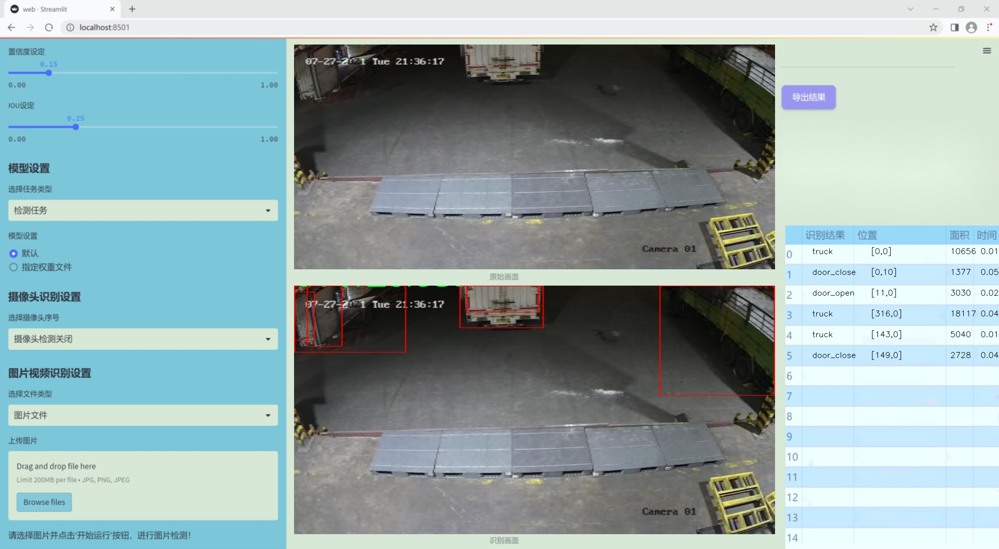
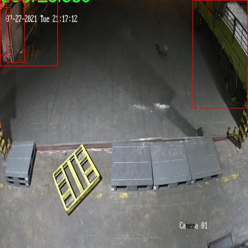
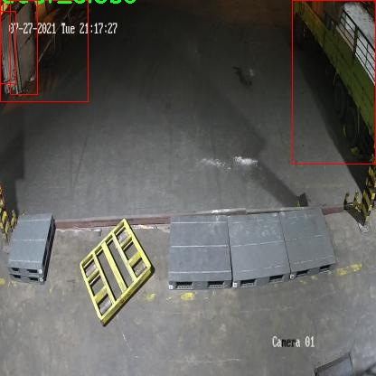
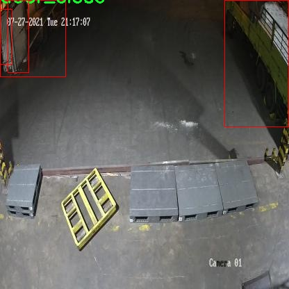

### 1.背景意义

研究背景与意义

随着物流行业的快速发展，卡车作为运输的重要工具，其门的开闭状态直接影响到货物的安全性和运输效率。因此，开发一种高效、准确的卡车门开闭状态检测系统显得尤为重要。传统的人工检测方法不仅耗时耗力，而且容易受到人为因素的影响，导致检测结果的不准确性。为了解决这一问题，基于深度学习的目标检测技术逐渐成为研究的热点，其中YOLO（You Only Look Once）系列模型因其实时性和高精度而受到广泛关注。

本研究旨在基于改进的YOLOv11模型，构建一个高效的卡车门开闭状态检测系统。我们将使用一个包含1100张图像的数据集，该数据集包括三类目标：关闭的门（door_close）、打开的门（door_open）和卡车（truck）。通过对这些图像进行标注和训练，模型将能够自动识别和分类卡车门的状态。这一系统的实现不仅能够提高检测的准确性，还能显著提升工作效率，减少人力成本。

此外，随着智能交通和自动驾驶技术的发展，卡车门开闭状态的实时监测也为智能物流系统的构建提供了重要的数据支持。通过将该检测系统与其他智能设备相结合，可以实现对卡车运输过程的全面监控，进而提高物流运输的安全性和可靠性。因此，本研究不仅具有重要的理论意义，还有着广泛的应用前景，为未来的智能物流和交通管理提供了新的思路和解决方案。

### 2.视频效果

[2.1 视频效果](https://www.bilibili.com/video/BV1qRmiYZEsh/)

### 3.图片效果




##### [项目涉及的源码数据来源链接](https://kdocs.cn/l/cszuIiCKVNis)**

注意：本项目提供训练的数据集和训练教程,由于版本持续更新,暂不提供权重文件（best.pt）,请按照6.训练教程进行训练后实现上图演示的效果。

### 4.数据集信息

##### 4.1 本项目数据集类别数＆类别名

nc: 3
names: ['door_close', 'door_open', 'truck']


该项目为【目标检测】数据集，请在【训练教程和Web端加载模型教程（第三步）】这一步的时候按照【目标检测】部分的教程来训练

##### 4.2 本项目数据集信息介绍

本项目数据集信息介绍

本项目旨在改进YOLOv11的卡车门开闭状态检测系统，为此我们使用了名为“yolov4-CAP”的数据集。该数据集专门设计用于训练和评估计算机视觉模型在卡车门状态检测方面的性能。数据集中包含三种主要类别，分别是“door_close”（门关闭）、“door_open”（门打开）和“truck”（卡车），这些类别的划分为模型的学习提供了清晰的目标和方向。

“yolov4-CAP”数据集的构建考虑到了多样性和现实场景的复杂性，确保模型在不同环境和条件下的鲁棒性。数据集中包含了多种不同类型的卡车，涵盖了各种角度和光照条件下的门开闭状态图像。这种多样性不仅有助于提高模型的泛化能力，还能使其在实际应用中更为有效。

在数据预处理阶段，我们对图像进行了标准化处理，并进行了数据增强，以提高模型的训练效果。通过随机裁剪、旋转、缩放等手段，增加了数据集的多样性，进一步提升了模型对不同情况的适应能力。此外，数据集中每个类别的样本数量经过精心设计，以确保模型在训练过程中能够均衡学习每个类别的特征。

总之，“yolov4-CAP”数据集为本项目提供了一个坚实的基础，使得改进后的YOLOv11模型能够准确、快速地检测卡车门的开闭状态，从而在物流、运输等行业中发挥重要作用。通过充分利用该数据集，我们期望能够显著提升模型的性能，为相关应用提供更为可靠的技术支持。









### 5.全套项目环境部署视频教程（零基础手把手教学）

[5.1 所需软件PyCharm和Anaconda安装教程（第一步）](https://www.bilibili.com/video/BV1BoC1YCEKi/?spm_id_from=333.999.0.0&vd_source=bc9aec86d164b67a7004b996143742dc)


[5.2 安装Python虚拟环境创建和依赖库安装视频教程（第二步）](https://www.bilibili.com/video/BV1ZoC1YCEBw?spm_id_from=333.788.videopod.sections&vd_source=bc9aec86d164b67a7004b996143742dc)

### 6.改进YOLOv11训练教程和Web_UI前端加载模型教程（零基础手把手教学）

[6.1 改进YOLOv11训练教程和Web_UI前端加载模型教程（第三步）](https://www.bilibili.com/video/BV1BoC1YCEhR?spm_id_from=333.788.videopod.sections&vd_source=bc9aec86d164b67a7004b996143742dc)


按照上面的训练视频教程链接加载项目提供的数据集，运行train.py即可开始训练



     Epoch   gpu_mem       box       obj       cls    labels  img_size
     1/200     20.8G   0.01576   0.01955  0.007536        22      1280: 100%|██████████| 849/849 [14:42<00:00,  1.04s/it]
               Class     Images     Labels          P          R     mAP@.5 mAP@.5:.95: 100%|██████████| 213/213 [01:14<00:00,  2.87it/s]
                 all       3395      17314      0.994      0.957      0.0957      0.0843

     Epoch   gpu_mem       box       obj       cls    labels  img_size
     2/200     20.8G   0.01578   0.01923  0.007006        22      1280: 100%|██████████| 849/849 [14:44<00:00,  1.04s/it]
               Class     Images     Labels          P          R     mAP@.5 mAP@.5:.95: 100%|██████████| 213/213 [01:12<00:00,  2.95it/s]
                 all       3395      17314      0.996      0.956      0.0957      0.0845

     Epoch   gpu_mem       box       obj       cls    labels  img_size
     3/200     20.8G   0.01561    0.0191  0.006895        27      1280: 100%|██████████| 849/849 [10:56<00:00,  1.29it/s]
               Class     Images     Labels          P          R     mAP@.5 mAP@.5:.95: 100%|███████   | 187/213 [00:52<00:00,  4.04it/s]
                 all       3395      17314      0.996      0.957      0.0957      0.0845


###### [项目数据集下载链接](https://kdocs.cn/l/cszuIiCKVNis)

### 7.原始YOLOv11算法讲解


ultralytics发布了最新的作品YOLOv11，这一次YOLOv11的变化相对于ultralytics公司的上一代作品YOLOv8变化不是很大的（YOLOv9、YOLOv10均不是ultralytics公司作品），其中改变的位置涉及到C2f变为C3K2，在SPPF后面加了一层类似于注意力机制的C2PSA，还有一个变化大家从yaml文件是看不出来的就是它的检测头内部替换了两个DWConv，以及模型的深度和宽度参数进行了大幅度调整，但是在损失函数方面就没有变化还是采用的CIoU作为边界框回归损失，下面带大家深入理解一下ultralytics最新作品YOLOv11的创新点。

**下图为最近的YOLO系列发布时间线！**


* * *

###### YOLOv11和YOLOv8对比

在YOLOYOLOv5，YOLOv8，和YOLOv11是ultralytics公司作品（ultralytics出品必属精品），下面用一张图片从yaml文件来带大家对比一下YOLOv8和YOLOv11的区别，配置文件变得内容比较少大家可以看一卡，左侧为YOLOv8右侧为YOLOv11，不同的点我用黑线标注了出来。


* * *

###### YOLOv11的网络结构解析

下面的图片为YOLOv11的网络结构图。


**其中主要创新点可以总结如下- > **

* * *

1\.
提出C3k2机制，其中C3k2有参数为c3k，其中在网络的浅层c3k设置为False（下图中可以看到c3k2第二个参数被设置为False，就是对应的c3k参数）。


此时所谓的C3k2就相当于YOLOv8中的C2f，其网络结构为一致的，其中的C3k机制的网络结构图如下图所示
**（为什么叫C3k2，我个人理解是因为C3k的调用时C3k其中的参数N固定设置为2的原因，个人理解不一定对** ）。


* * *

2\.
第二个创新点是提出C2PSA机制，这是一个C2（C2f的前身）机制内部嵌入了一个多头注意力机制，在这个过程中我还发现作者尝试了C2fPSA机制但是估计效果不如C2PSA，有的时候机制有没有效果理论上真的很难解释通，下图为C2PSA机制的原理图，仔细观察把Attention哪里去掉则C2PSA机制就变为了C2所以我上面说C2PSA就是C2里面嵌入了一个PSA机制。


* * *

3\.
第三个创新点可以说是原先的解耦头中的分类检测头增加了两个DWConv，具体的对比大家可以看下面两个图下面的是YOLOv11的解耦头，上面的是YOLOv8的解耦头.


我们上面看到了在分类检测头中YOLOv11插入了两个DWConv这样的做法可以大幅度减少参数量和计算量（原先两个普通的Conv大家要注意到卷积和是由3变为了1的，这是形成了两个深度可分离Conv），大家可能不太理解为什么加入了两个DWConv还能够减少计算量，以及什么是深度可分离Conv，下面我来解释一下。

> **`DWConv` 代表 Depthwise
> Convolution（深度卷积）**，是一种在卷积神经网络中常用的高效卷积操作。它主要用于减少计算复杂度和参数量，尤其在移动端或轻量化网络（如
> MobileNet）中十分常见。
>
> **1\. 标准卷积的计算过程**
>
> 在标准卷积操作中，对于一个输入张量（通常是一个多通道的特征图），卷积核的尺寸是 `(h, w, C_in)`，其中 `h` 和 `w`
> 是卷积核的空间尺寸，`C_in`
> 是输入通道的数量。而卷积核与输入张量做的是完整的卷积运算，每个输出通道都与所有输入通道相连并参与卷积操作，导致计算量比较大。
>
> 标准卷积的计算过程是这样的：
>
>   * 每个输出通道是所有输入通道的组合（加权求和），卷积核在每个位置都会计算与所有输入通道的点积。
>   * 假设有 `C_in` 个输入通道和 `C_out` 个输出通道，那么卷积核的总参数量是 `C_in * C_out * h * w`。
>

>
> 2\. **Depthwise Convolution（DWConv）**
>
> 与标准卷积不同， **深度卷积** 将输入的每个通道单独处理，即 **每个通道都有自己的卷积核进行卷积**
> ，不与其他通道进行交互。它可以被看作是标准卷积的一部分，专注于空间维度上的卷积运算。
>
> **深度卷积的计算过程：**
>
>   * 假设输入张量有 `C_in` 个通道，每个通道会使用一个 `h × w`
> 的卷积核进行卷积操作。这个过程称为“深度卷积”，因为每个通道独立进行卷积运算。
>   * 输出的通道数与输入通道数一致，每个输出通道只和对应的输入通道进行卷积，没有跨通道的组合。
>   * 参数量和计算量相比标准卷积大大减少，卷积核的参数量是 `C_in * h * w`。
>

>
> **深度卷积的优点：**
>
>   1. **计算效率高** ：相对于标准卷积，深度卷积显著减少了计算量。它只处理空间维度上的卷积，不再处理通道间的卷积。
>   2.  **参数量减少** ：由于每个卷积核只对单个通道进行卷积，参数量大幅减少。例如，标准卷积的参数量为 `C_in * C_out * h *
> w`，而深度卷积的参数量为 `C_in * h * w`。
>   3.  **结合点卷积可提升效果** ：为了弥补深度卷积缺乏跨通道信息整合的问题，通常深度卷积后会配合 `1x1` 的点卷积（Pointwise
> Convolution）使用，通过 `1x1` 的卷积核整合跨通道的信息。这种组合被称为 **深度可分离卷积** （Depthwise
> Separable Convolution） | **这也是我们本文YOLOv11中的做法** 。
>

>
> 3\. **深度卷积与标准卷积的区别**
>
> 操作类型| 卷积核大小| 输入通道数| 输出通道数| 参数量  
> ---|---|---|---|---  
> 标准卷积| `h × w`| `C_in`| `C_out`| `C_in * C_out * h * w`  
> 深度卷积（DWConv）| `h × w`| `C_in`| `C_in`| `C_in * h * w`  
>  
> 可以看出，深度卷积在相同的卷积核大小下，参数量减少了约 `C_out` 倍
> （细心的人可以发现用最新版本的ultralytics仓库运行YOLOv8参数量相比于之前的YOLOv8以及大幅度减少了这就是因为检测头改了的原因但是名字还是Detect，所以如果你想继续用YOLOv8发表论文做实验那么不要更新最近的ultralytics仓库）。
>
> **4\. 深度可分离卷积 (Depthwise Separable Convolution)**
>
> 深度卷积常与 `1x1` 的点卷积配合使用，这称为深度可分离卷积。其过程如下：
>
>   1. 先对输入张量进行深度卷积，对每个通道独立进行空间卷积。
>   2. 然后通过 `1x1` 点卷积，对通道维度进行混合，整合不同通道的信息。
>

>
> 这样既可以保证计算量的减少，又可以保持跨通道的信息流动。
>
> 5\. **总结**
>
> `DWConv` 是一种高效的卷积方式，通过单独处理每个通道来减少计算量，结合 `1x1`
> 的点卷积，形成深度可分离卷积，可以在保持网络性能的同时极大地减少模型的计算复杂度和参数量。

**看到这里大家应该明白了为什么加入了两个DWConv还能减少参数量以及YOLOv11的检测头创新点在哪里。**

* * *

##### YOLOv11和YOLOv8还有一个不同的点就是其各个版本的模型（N - S - M- L - X）网络深度和宽度变了


可以看到在深度（depth）和宽度
（width）两个地方YOLOv8和YOLOv11是基本上完全不同了，这里我理解这么做的含义就是模型网络变小了，所以需要加深一些模型的放缩倍数来弥补模型之前丧失的能力从而来达到一个平衡。

> **本章总结：**
> YOLOv11的改进点其实并不多更多的都是一些小的结构上的创新，相对于之前的YOLOv5到YOLOv8的创新，其实YOLOv11的创新点不算多，但是其是ultralytics公司的出品，同时ultralytics仓库的使用量是非常多的（不像YOLOv9和YOLOv10）所以在未来的很长一段时间内其实YOLO系列估计不会再更新了，YOLOv11作为最新的SOTA肯定是十分适合大家来发表论文和创新的。
>

### 8.200+种全套改进YOLOV11创新点原理讲解

#### 8.1 200+种全套改进YOLOV11创新点原理讲解大全

由于篇幅限制，每个创新点的具体原理讲解就不全部展开，具体见下列网址中的改进模块对应项目的技术原理博客网址【Blog】（创新点均为模块化搭建，原理适配YOLOv5~YOLOv11等各种版本）

[改进模块技术原理博客【Blog】网址链接](https://gitee.com/qunmasj/good)


#### 8.2 精选部分改进YOLOV11创新点原理讲解

###### 这里节选部分改进创新点展开原理讲解(完整的改进原理见上图和[改进模块技术原理博客链接](https://gitee.com/qunmasj/good)【如果此小节的图加载失败可以通过CSDN或者Github搜索该博客的标题访问原始博客，原始博客图片显示正常】


借鉴了其他算法的这些设计思想

借鉴了VGG的思想，使用了较多的3×3卷积，在每一次池化操作后，将通道数翻倍；

借鉴了network in network的思想，使用全局平均池化（global average pooling）做预测，并把1×1的卷积核置于3×3的卷积核之间，用来压缩特征；（我没找到这一步体现在哪里）

使用了批归一化层稳定模型训练，加速收敛，并且起到正则化作用。

    以上三点为Darknet19借鉴其他模型的点。Darknet53当然是在继承了Darknet19的这些优点的基础上再新增了下面这些优点的。因此列在了这里

借鉴了ResNet的思想，在网络中大量使用了残差连接，因此网络结构可以设计的很深，并且缓解了训练中梯度消失的问题，使得模型更容易收敛。

使用步长为2的卷积层代替池化层实现降采样。（这一点在经典的Darknet-53上是很明显的，output的长和宽从256降到128，再降低到64，一路降低到8，应该是通过步长为2的卷积层实现的；在YOLOv11的卷积层中也有体现，比如图中我标出的这些位置）

#### 特征融合

模型架构图如下

  Darknet-53的特点可以这样概括：（Conv卷积模块+Residual Block残差块）串行叠加4次

  Conv卷积层+Residual Block残差网络就被称为一个stage


上面红色指出的那个，原始的Darknet-53里面有一层 卷积，在YOLOv11里面，把一层卷积移除了

为什么移除呢？

        原始Darknet-53模型中间加的这个卷积层做了什么？滤波器（卷积核）的个数从 上一个卷积层的512个，先增加到1024个卷积核，然后下一层卷积的卷积核的个数又降低到512个

        移除掉这一层以后，少了1024个卷积核，就可以少做1024次卷积运算，同时也少了1024个3×3的卷积核的参数，也就是少了9×1024个参数需要拟合。这样可以大大减少了模型的参数，（相当于做了轻量化吧）

        移除掉这个卷积层，可能是因为作者发现移除掉这个卷积层以后，模型的score有所提升，所以才移除掉的。为什么移除掉以后，分数有所提高呢？可能是因为多了这些参数就容易，参数过多导致模型在训练集删过拟合，但是在测试集上表现很差，最终模型的分数比较低。你移除掉这个卷积层以后，参数减少了，过拟合现象不那么严重了，泛化能力增强了。当然这个是，拿着你做实验的结论，反过来再找补，再去强行解释这种现象的合理性。

过拟合


通过MMdetection官方绘制册这个图我们可以看到，进来的这张图片经过一个“Feature Pyramid Network(简称FPN)”，然后最后的P3、P4、P5传递给下一层的Neck和Head去做识别任务。 PAN（Path Aggregation Network）


“FPN是自顶向下，将高层的强语义特征传递下来。PAN就是在FPN的后面添加一个自底向上的金字塔，对FPN补充，将低层的强定位特征传递上去，

FPN是自顶（小尺寸，卷积次数多得到的结果，语义信息丰富）向下（大尺寸，卷积次数少得到的结果），将高层的强语义特征传递下来，对整个金字塔进行增强，不过只增强了语义信息，对定位信息没有传递。PAN就是针对这一点，在FPN的后面添加一个自底（卷积次数少，大尺寸）向上（卷积次数多，小尺寸，语义信息丰富）的金字塔，对FPN补充，将低层的强定位特征传递上去，又被称之为“双塔战术”。

FPN层自顶向下传达强语义特征，而特征金字塔则自底向上传达强定位特征，两两联手，从不同的主干层对不同的检测层进行参数聚合,这样的操作确实很皮。
#### 自底向上增强

而 PAN（Path Aggregation Network）是对 FPN 的一种改进，它的设计理念是在 FPN 后面添加一个自底向上的金字塔。PAN 引入了路径聚合的方式，通过将浅层特征图（低分辨率但语义信息较弱）和深层特征图（高分辨率但语义信息丰富）进行聚合，并沿着特定的路径传递特征信息，将低层的强定位特征传递上去。这样的操作能够进一步增强多尺度特征的表达能力，使得 PAN 在目标检测任务中表现更加优秀。


### 可重参化EfficientRepBiPAN优化Neck
#### Repvgg-style
Repvgg-style的卷积层包含
卷积+ReLU结构，该结构能够有效地利用硬件资源。

在训练时，Repvgg-style的卷积层包含
卷积、
卷积、identity。（下图左图）


在推理时，通过重参数化（re-parameterization），上述的多分支结构可以转换为单分支的
卷积。（下图右图）


基于上述思想，作者设计了对GPU硬件友好的EfficientRep Backbone和Rep-PAN Neck，将它们用于YOLOv6中。

EfficientRep Backbone的结构图：


Rep-PAN Neck结构图：


#### Multi-path
只使用repvgg-style不能达到很好的精度-速度平衡，对于大模型，作者探索了多路径的网络结构。

参考该博客提出了Bep unit，其结构如下图所示：


CSP（Cross Stage Partial）-style计算量小，且有丰富的梯度融合信息，广泛应用于YOLO系列中，比如YOLOv11、PPYOLOE。

作者将Bep unit与CSP-style结合，设计了一种新的网络结构BepC3，如下图所示：


基于BepC3模块，作者设计了新的CSPBep Backbone和CSPRepPAN Neck，以达到很好的精度-速度平衡。

其他YOLO系列在使用CSP-stype结构时，partial ratio设置为1/2。为了达到更好的性能，在YOLOv6m中partial ratio的值为2/3，在YOLOv6l中partial ratio的值为1/2。

对于YOLOv6m，单纯使用Rep-style结构和使用BepC3结构的对比如下图所示：

#### BIFPN
BiFPN 全称 Bidirectional Feature Pyramid Network 加权双向（自顶向下 + 自低向上）特征金字塔网络。

相比较于PANet，BiFPN在设计上的改变：

总结下图：
图d 蓝色部分为自顶向下的通路，传递的是高层特征的语义信息；红色部分是自底向上的通路，传递的是低层特征的位置信息；紫色部分是上述第二点提到的同一层在输入节点和输入节点间新加的一条边。


我们删除那些只有一条输入边的节点。这么做的思路很简单：如果一个节点只有一条输入边而没有特征融合，那么它对旨在融合不同特征的特征网络的贡献就会很小。删除它对我们的网络影响不大，同时简化了双向网络；如上图d 的 P7右边第一个节点

如果原始输入节点和输出节点处于同一层，我们会在原始输入节点和输出节点之间添加一条额外的边。思路：以在不增加太多成本的情况下融合更多的特性；

与只有一个自顶向下和一个自底向上路径的PANet不同，我们处理每个双向路径(自顶向下和自底而上)路径作为一个特征网络层，并重复同一层多次，以实现更高层次的特征融合。如下图EfficientNet 的网络结构所示，我们对BiFPN是重复使用多次的。而这个使用次数也不是我们认为设定的，而是作为参数一起加入网络的设计当中，使用NAS技术算出来的。


Weighted Feature Fusion 带权特征融合：学习不同输入特征的重要性，对不同输入特征有区分的融合。
设计思路：传统的特征融合往往只是简单的 feature map 叠加/相加 (sum them up)，比如使用concat或者shortcut连接，而不对同时加进来的 feature map 进行区分。然而，不同的输入 feature map 具有不同的分辨率，它们对融合输入 feature map 的贡献也是不同的，因此简单的对他们进行相加或叠加处理并不是最佳的操作。所以这里我们提出了一种简单而高效的加权特融合的机制。
常见的带权特征融合有三种方法，分别是：


​
  这种方法比较简单，直接加一个可学习的权重。但是由于这个权重不受限制，所有可能引起训练的不稳定，所有并不推荐。
Softmax-based fusion: O = ∑ i e w i ∗ I i ϵ + ∑ j e w j O = \sum_{i} \frac{e^{w_i} * I_i}{ \epsilon+\sum_{j}e^{w_j}}O=∑ 

 

​
  使用这种方法可以将范围放缩到 [ 0 , 1 ] [0, 1][0,1] 之间，训练稳定，但是训练很慢，所有也不推荐。
Fast normalized fusion: O = ∑ i w i ∗ I i ϵ + ∑ j w j O = \sum_{i} \frac{w_i * I_i}{ \epsilon+\sum_{j}w_j}O=∑ 


### 9.系统功能展示

图9.1.系统支持检测结果表格显示

  图9.2.系统支持置信度和IOU阈值手动调节

  图9.3.系统支持自定义加载权重文件best.pt(需要你通过步骤5中训练获得)

  图9.4.系统支持摄像头实时识别

  图9.5.系统支持图片识别

  图9.6.系统支持视频识别

  图9.7.系统支持识别结果文件自动保存

  图9.8.系统支持Excel导出检测结果数据


### 10. YOLOv11核心改进源码讲解

#### 10.1 kagn_conv.py

以下是对代码的核心部分进行分析和详细注释的结果：

```python
# 导入必要的库
from functools import lru_cache
import torch
import torch.nn as nn
from torch.nn.functional import conv3d, conv2d, conv1d

# 定义一个通用的卷积层类 KAGNConvNDLayer
class KAGNConvNDLayer(nn.Module):
    def __init__(self, conv_class, norm_class, conv_w_fun, input_dim, output_dim, degree, kernel_size,
                 groups=1, padding=0, stride=1, dilation=1, dropout: float = 0.0, ndim: int = 2):
        super(KAGNConvNDLayer, self).__init__()
        
        # 初始化参数
        self.inputdim = input_dim  # 输入维度
        self.outdim = output_dim    # 输出维度
        self.degree = degree         # 多项式的度数
        self.kernel_size = kernel_size  # 卷积核大小
        self.padding = padding       # 填充
        self.stride = stride         # 步幅
        self.dilation = dilation     # 膨胀
        self.groups = groups         # 分组卷积的组数
        self.base_activation = nn.SiLU()  # 基础激活函数
        self.conv_w_fun = conv_w_fun  # 卷积权重函数
        self.ndim = ndim             # 数据的维度
        self.dropout = None          # Dropout层初始化
        
        # 根据维度选择Dropout层
        if dropout > 0:
            if ndim == 1:
                self.dropout = nn.Dropout1d(p=dropout)
            elif ndim == 2:
                self.dropout = nn.Dropout2d(p=dropout)
            elif ndim == 3:
                self.dropout = nn.Dropout3d(p=dropout)

        # 检查参数的有效性
        if groups <= 0:
            raise ValueError('groups must be a positive integer')
        if input_dim % groups != 0:
            raise ValueError('input_dim must be divisible by groups')
        if output_dim % groups != 0:
            raise ValueError('output_dim must be divisible by groups')

        # 创建分组卷积层和归一化层
        self.base_conv = nn.ModuleList([conv_class(input_dim // groups,
                                                   output_dim // groups,
                                                   kernel_size,
                                                   stride,
                                                   padding,
                                                   dilation,
                                                   groups=1,
                                                   bias=False) for _ in range(groups)])

        self.layer_norm = nn.ModuleList([norm_class(output_dim // groups) for _ in range(groups)])

        # 多项式权重的形状
        poly_shape = (groups, output_dim // groups, (input_dim // groups) * (degree + 1)) + tuple(
            kernel_size for _ in range(ndim))

        # 初始化多项式权重和beta权重
        self.poly_weights = nn.Parameter(torch.randn(*poly_shape))
        self.beta_weights = nn.Parameter(torch.zeros(degree + 1, dtype=torch.float32))

        # 使用Kaiming均匀分布初始化卷积层的权重
        for conv_layer in self.base_conv:
            nn.init.kaiming_uniform_(conv_layer.weight, nonlinearity='linear')

        nn.init.kaiming_uniform_(self.poly_weights, nonlinearity='linear')
        nn.init.normal_(
            self.beta_weights,
            mean=0.0,
            std=1.0 / ((kernel_size ** ndim) * self.inputdim * (self.degree + 1.0)),
        )

    # 计算beta值
    def beta(self, n, m):
        return (
            ((m + n) * (m - n) * n ** 2) / (m ** 2 / (4.0 * n ** 2 - 1.0))
        ) * self.beta_weights[n]

    # 计算Gram多项式
    @lru_cache(maxsize=128)  # 使用缓存避免重复计算
    def gram_poly(self, x, degree):
        p0 = x.new_ones(x.size())  # 初始化p0为全1的张量

        if degree == 0:
            return p0.unsqueeze(-1)  # 如果度数为0，返回p0

        p1 = x  # p1初始化为输入x
        grams_basis = [p0, p1]  # 存储Gram基的列表

        # 计算Gram多项式
        for i in range(2, degree + 1):
            p2 = x * p1 - self.beta(i - 1, i) * p0  # 递归计算
            grams_basis.append(p2)  # 添加到基列表
            p0, p1 = p1, p2  # 更新p0和p1

        return torch.cat(grams_basis, dim=1)  # 返回拼接后的Gram基

    # 前向传播方法
    def forward_kag(self, x, group_index):
        # 应用基础激活函数并进行卷积
        basis = self.base_conv[group_index](self.base_activation(x))

        # 将x归一化到[-1, 1]范围
        x = torch.tanh(x).contiguous()

        if self.dropout is not None:
            x = self.dropout(x)  # 应用Dropout

        # 计算Gram基
        grams_basis = self.base_activation(self.gram_poly(x, self.degree))

        # 使用卷积权重函数计算输出
        y = self.conv_w_fun(grams_basis, self.poly_weights[group_index],
                            stride=self.stride, dilation=self.dilation,
                            padding=self.padding, groups=1)

        # 应用归一化和激活函数
        y = self.base_activation(self.layer_norm[group_index](y + basis))

        return y

    # 总的前向传播方法
    def forward(self, x):
        # 将输入x按组分割
        split_x = torch.split(x, self.inputdim // self.groups, dim=1)
        output = []
        for group_ind, _x in enumerate(split_x):
            y = self.forward_kag(_x.clone(), group_ind)  # 对每组进行前向传播
            output.append(y.clone())  # 收集输出
        y = torch.cat(output, dim=1)  # 拼接输出
        return y

# 3D卷积层的具体实现
class KAGNConv3DLayer(KAGNConvNDLayer):
    def __init__(self, input_dim, output_dim, kernel_size, degree=3, groups=1, padding=0, stride=1, dilation=1,
                 dropout: float = 0.0):
        super(KAGNConv3DLayer, self).__init__(nn.Conv3d, nn.InstanceNorm3d, conv3d,
                                              input_dim, output_dim,
                                              degree, kernel_size,
                                              groups=groups, padding=padding, stride=stride, dilation=dilation,
                                              ndim=3, dropout=dropout)

# 2D卷积层的具体实现
class KAGNConv2DLayer(KAGNConvNDLayer):
    def __init__(self, input_dim, output_dim, kernel_size, degree=3, groups=1, padding=0, stride=1, dilation=1,
                 dropout: float = 0.0, norm_layer=nn.InstanceNorm2d):
        super(KAGNConv2DLayer, self).__init__(nn.Conv2d, norm_layer, conv2d,
                                              input_dim, output_dim,
                                              degree, kernel_size,
                                              groups=groups, padding=padding, stride=stride, dilation=dilation,
                                              ndim=2, dropout=dropout)

# 1D卷积层的具体实现
class KAGNConv1DLayer(KAGNConvNDLayer):
    def __init__(self, input_dim, output_dim, kernel_size, degree=3, groups=1, padding=0, stride=1, dilation=1,
                 dropout: float = 0.0):
        super(KAGNConv1DLayer, self).__init__(nn.Conv1d, nn.InstanceNorm1d, conv1d,
                                              input_dim, output_dim,
                                              degree, kernel_size,
                                              groups=groups, padding=padding, stride=stride, dilation=dilation,
                                              ndim=1, dropout=dropout)
```

### 代码分析总结：
1. **KAGNConvNDLayer** 是一个通用的卷积层类，支持任意维度的卷积（1D、2D、3D）。
2. **初始化** 方法中，设置了卷积层、归一化层、Dropout层等，并进行了权重的初始化。
3. **Gram多项式**的计算使用了递归关系，并且通过缓存机制提高了效率。
4. **前向传播**方法中，输入被分割成多个组，并对每个组进行独立的卷积操作，最后将结果拼接在一起。
5. **KAGNConv3DLayer、KAGNConv2DLayer、KAGNConv1DLayer** 分别是对不同维度卷积的具体实现，继承自通用的KAGNConvNDLayer。


#### 10.1 mamba_yolo.py

以下是代码中最核心的部分，并附上详细的中文注释：

```python
import torch
import torch.nn as nn
from einops import rearrange

class LayerNorm2d(nn.Module):
    """自定义的二维层归一化类"""
    def __init__(self, normalized_shape, eps=1e-6, elementwise_affine=True):
        super().__init__()
        # 使用 PyTorch 的 LayerNorm 进行归一化
        self.norm = nn.LayerNorm(normalized_shape, eps, elementwise_affine)

    def forward(self, x):
        # 将输入张量的形状从 (B, C, H, W) 转换为 (B, H, W, C)
        x = rearrange(x, 'b c h w -> b h w c').contiguous()
        # 进行归一化
        x = self.norm(x)
        # 将张量的形状恢复为 (B, C, H, W)
        x = rearrange(x, 'b h w c -> b c h w').contiguous()
        return x

class CrossScan(torch.autograd.Function):
    """交叉扫描的自定义函数"""
    @staticmethod
    def forward(ctx, x: torch.Tensor):
        B, C, H, W = x.shape
        ctx.shape = (B, C, H, W)
        # 创建一个新的张量，用于存储交叉扫描的结果
        xs = x.new_empty((B, 4, C, H * W))
        # 进行正向交叉扫描
        xs[:, 0] = x.flatten(2, 3)  # 正常顺序
        xs[:, 1] = x.transpose(dim0=2, dim1=3).flatten(2, 3)  # 旋转90度
        xs[:, 2:4] = torch.flip(xs[:, 0:2], dims=[-1])  # 反转
        return xs

    @staticmethod
    def backward(ctx, ys: torch.Tensor):
        # 反向传播
        B, C, H, W = ctx.shape
        L = H * W
        # 计算梯度
        ys = ys[:, 0:2] + ys[:, 2:4].flip(dims=[-1]).view(B, 2, -1, L)
        y = ys[:, 0] + ys[:, 1].view(B, -1, W, H).transpose(dim0=2, dim1=3).contiguous().view(B, -1, L)
        return y.view(B, -1, H, W)

class SelectiveScanCore(torch.autograd.Function):
    """选择性扫描的自定义函数"""
    @staticmethod
    @torch.cuda.amp.custom_fwd
    def forward(ctx, u, delta, A, B, C, D=None, delta_bias=None, delta_softplus=False, nrows=1, backnrows=1):
        # 确保输入张量是连续的
        if u.stride(-1) != 1:
            u = u.contiguous()
        if delta.stride(-1) != 1:
            delta = delta.contiguous()
        if D is not None and D.stride(-1) != 1:
            D = D.contiguous()
        if B.stride(-1) != 1:
            B = B.contiguous()
        if C.stride(-1) != 1:
            C = C.contiguous()
        # 如果 B 或 C 是三维的，增加一个维度
        if B.dim() == 3:
            B = B.unsqueeze(dim=1)
            ctx.squeeze_B = True
        if C.dim() == 3:
            C = C.unsqueeze(dim=1)
            ctx.squeeze_C = True
        ctx.delta_softplus = delta_softplus
        ctx.backnrows = backnrows
        # 调用 CUDA 核心进行前向计算
        out, x, *rest = selective_scan_cuda_core.fwd(u, delta, A, B, C, D, delta_bias, delta_softplus, 1)
        ctx.save_for_backward(u, delta, A, B, C, D, delta_bias, x)
        return out

    @staticmethod
    @torch.cuda.amp.custom_bwd
    def backward(ctx, dout, *args):
        # 反向传播
        u, delta, A, B, C, D, delta_bias, x = ctx.saved_tensors
        if dout.stride(-1) != 1:
            dout = dout.contiguous()
        du, ddelta, dA, dB, dC, dD, ddelta_bias, *rest = selective_scan_cuda_core.bwd(
            u, delta, A, B, C, D, delta_bias, dout, x, ctx.delta_softplus, 1
        )
        return (du, ddelta, dA, dB, dC, dD, ddelta_bias, None, None, None, None)

def cross_selective_scan(
        x: torch.Tensor,
        x_proj_weight: torch.Tensor,
        dt_projs_weight: torch.Tensor,
        A_logs: torch.Tensor,
        Ds: torch.Tensor,
        out_norm: torch.nn.Module,
        nrows=-1,
        backnrows=-1,
        delta_softplus=True,
        to_dtype=True,
):
    """交叉选择性扫描的主函数"""
    B, D, H, W = x.shape
    L = H * W

    # 调用 CrossScan 进行交叉扫描
    xs = CrossScan.apply(x)

    # 进行线性变换
    x_dbl = torch.einsum("b k d l, k c d -> b k c l", xs, x_proj_weight)
    dts, Bs, Cs = torch.split(x_dbl, [R, N, N], dim=2)
    dts = torch.einsum("b k r l, k d r -> b k d l", dts, dt_projs_weight)

    # HiPPO 矩阵
    As = -torch.exp(A_logs.to(torch.float))  # 计算 A
    Bs = Bs.contiguous()
    Cs = Cs.contiguous()
    Ds = Ds.to(torch.float)  # 转换为浮点数
    delta_bias = dt_projs_bias.view(-1).to(torch.float)

    # 进行选择性扫描
    ys: torch.Tensor = SelectiveScan.apply(
        xs, dts, As, Bs, Cs, Ds, delta_bias, delta_softplus
    ).view(B, K, -1, H, W)

    # 合并结果
    y: torch.Tensor = CrossMerge.apply(ys)

    # 进行归一化
    y = out_norm(y).view(B, H, W, -1)

    return (y.to(x.dtype) if to_dtype else y)

class SS2D(nn.Module):
    """选择性扫描的二维实现"""
    def __init__(self, d_model=96, d_state=16, ssm_ratio=2.0, **kwargs):
        super().__init__()
        self.in_proj = nn.Conv2d(d_model, d_model * ssm_ratio, kernel_size=1)
        self.out_proj = nn.Conv2d(d_model * ssm_ratio, d_model, kernel_size=1)

    def forward(self, x: torch.Tensor):
        x = self.in_proj(x)
        x = cross_selective_scan(x, self.x_proj_weight, self.dt_projs_weight, self.A_logs, self.Ds, self.out_norm)
        x = self.out_proj(x)
        return x
```

### 代码核心部分说明：
1. **LayerNorm2d**: 自定义的二维层归一化模块，主要用于对输入的特征图进行归一化处理，确保每个通道的均值和方差在训练过程中保持稳定。

2. **CrossScan**: 自定义的交叉扫描函数，负责对输入的特征图进行不同方向的扫描，并生成新的特征表示。

3. **SelectiveScanCore**: 选择性扫描的核心实现，负责前向和反向传播的计算，使用 CUDA 加速以提高性能。

4. **cross_selective_scan**: 该函数是选择性扫描的主入口，整合了交叉扫描和选择性扫描的过程，并进行线性变换和归一化。

5. **SS2D**: 选择性扫描的二维实现，包含输入和输出的卷积层，负责特征的转换和处理。

这些核心部分共同构成了一个高效的特征提取和处理模块，适用于计算机视觉任务中的深度学习模型。

这个程序文件 `mamba_yolo.py` 实现了一个基于深度学习的模型，主要用于计算机视觉任务，特别是目标检测。文件中包含了多个类和函数，以下是对其主要内容的逐步讲解。

首先，文件导入了一些必要的库，包括 `torch`、`math`、`functools` 和 `torch.nn`，以及一些其他的模块如 `einops` 和 `timm.layers`。这些库提供了构建神经网络所需的基础功能和工具。

接下来，定义了一个 `LayerNorm2d` 类，该类实现了二维层归一化。它的 `forward` 方法将输入张量的维度进行调整，以适应 `LayerNorm` 的要求，并在处理后再调整回原来的维度。

`autopad` 函数用于自动计算卷积操作的填充，以确保输出的形状与输入相同。它根据卷积核的大小和膨胀因子来决定填充的大小。

然后，定义了几个自定义的 PyTorch 函数类，包括 `CrossScan` 和 `CrossMerge`，这些类用于实现特定的张量操作。`CrossScan` 类用于在张量的不同维度上进行扫描操作，而 `CrossMerge` 类则用于合并这些扫描的结果。

`SelectiveScanCore` 类实现了选择性扫描的核心功能。它的 `forward` 和 `backward` 方法分别定义了前向传播和反向传播的逻辑，使用了 CUDA 加速的自定义操作来提高性能。

`cross_selective_scan` 函数是一个封装函数，负责调用选择性扫描的核心操作，并处理输入数据的转换和输出结果的格式化。

接下来，定义了 `SS2D` 类，它是一个基于选择性扫描的二维模块。该模块包括多个参数，如模型维度、状态维度、卷积层设置等。它的 `forward` 方法实现了数据的前向传播逻辑，使用了前面定义的选择性扫描功能。

随后，定义了 `RGBlock` 和 `LSBlock` 类，这些类实现了特定的卷积块结构，分别用于处理输入特征并应用激活函数和归一化。

`XSSBlock` 和 `VSSBlock_YOLO` 类是更复杂的模块，结合了前面定义的功能块，构建了更高层次的网络结构。它们实现了前向传播逻辑，并根据输入特征的维度和其他参数动态调整网络的行为。

`SimpleStem` 类实现了一个简单的卷积层序列，用于处理输入图像并生成特征图。`VisionClueMerge` 类则用于将多个特征图合并，以生成最终的输出。

整体来看，这个文件定义了一个复杂的神经网络架构，结合了选择性扫描和卷积操作，旨在提高计算效率和模型性能，适用于目标检测等计算机视觉任务。

#### 10.2 orepa.py

以下是经过简化和注释的核心代码部分，主要集中在 `OREPA` 类及其相关功能上：

```python
import torch
import torch.nn as nn
import torch.nn.functional as F
import numpy as np

# OREPA类定义
class OREPA(nn.Module):
    def __init__(self, in_channels, out_channels, kernel_size=3, stride=1, padding=None, groups=1, dilation=1, act=True):
        super(OREPA, self).__init__()
        
        # 初始化参数
        self.nonlinear = nn.ReLU() if act else nn.Identity()  # 激活函数
        self.kernel_size = kernel_size
        self.in_channels = in_channels
        self.out_channels = out_channels
        self.groups = groups
        self.stride = stride
        self.padding = padding if padding is not None else (kernel_size // 2)  # 默认填充
        self.dilation = dilation

        # 定义权重参数
        self.weight_orepa_origin = nn.Parameter(torch.Tensor(out_channels, in_channels // groups, kernel_size, kernel_size))
        nn.init.kaiming_uniform_(self.weight_orepa_origin)  # 权重初始化

        # 其他分支的权重参数
        self.weight_orepa_avg_conv = nn.Parameter(torch.Tensor(out_channels, in_channels // groups, 1, 1))
        nn.init.kaiming_uniform_(self.weight_orepa_avg_conv)

        self.weight_orepa_1x1 = nn.Parameter(torch.Tensor(out_channels, in_channels // groups, 1, 1))
        nn.init.kaiming_uniform_(self.weight_orepa_1x1)

        # 向量参数，用于加权组合不同分支的输出
        self.vector = nn.Parameter(torch.Tensor(3, out_channels))
        nn.init.constant_(self.vector[0, :], 1.0)  # origin
        nn.init.constant_(self.vector[1, :], 0.0)  # avg
        nn.init.constant_(self.vector[2, :], 0.0)  # 1x1

    def weight_gen(self):
        # 生成加权后的卷积核
        weight_orepa_origin = self.weight_orepa_origin * self.vector[0, :].view(-1, 1, 1, 1)
        weight_orepa_avg = self.weight_orepa_avg_conv * self.vector[1, :].view(-1, 1, 1, 1)
        weight_orepa_1x1 = self.weight_orepa_1x1 * self.vector[2, :].view(-1, 1, 1, 1)

        # 返回所有分支的加权和
        return weight_orepa_origin + weight_orepa_avg + weight_orepa_1x1

    def forward(self, inputs):
        # 生成权重并进行卷积操作
        weight = self.weight_gen()
        out = F.conv2d(inputs, weight, stride=self.stride, padding=self.padding, dilation=self.dilation, groups=self.groups)
        return self.nonlinear(out)  # 应用激活函数

# 其他类和功能省略
```

### 代码说明：
1. **OREPA类**：该类是一个自定义的卷积层，使用多个分支（origin、avg、1x1）来生成最终的卷积核。每个分支的权重通过一个向量进行加权组合。
2. **初始化方法**：在初始化中定义了输入输出通道、卷积核大小、步幅、填充、组数和扩张等参数，并为每个分支的权重参数进行了初始化。
3. **权重生成**：`weight_gen` 方法根据当前的向量参数生成最终的卷积核。
4. **前向传播**：在 `forward` 方法中，调用 `weight_gen` 生成权重后，使用 `F.conv2d` 进行卷积操作，并应用激活函数。

以上是对代码的核心部分进行了简化和详细注释，便于理解其主要功能和结构。

这个程序文件 `orepa.py` 是一个用于实现深度学习模型中 OREPA（Optimized Reparameterization for Efficient Convolution）模块的 PyTorch 代码。OREPA 模块主要用于提高卷积神经网络的效率和性能，特别是在模型推理阶段。

文件中首先导入了必要的库，包括 PyTorch、NumPy 以及一些自定义的模块。接着定义了一些辅助函数，如 `transI_fusebn` 和 `transVI_multiscale`，用于处理卷积核和批归一化层的融合，以及对卷积核进行多尺度填充。

`OREPA` 类是该文件的核心部分，继承自 `nn.Module`。在初始化方法中，定义了多个参数，包括输入和输出通道数、卷积核大小、步幅、填充、分组卷积、扩张率等。根据是否部署（deploy）模式，初始化不同的卷积层和参数。该类的主要功能是生成卷积权重，并在前向传播中使用这些权重进行卷积操作。

`weight_gen` 方法负责生成最终的卷积权重，通过对不同分支的权重进行加权组合，形成最终的卷积核。`forward` 方法则实现了前向传播，使用生成的权重对输入进行卷积，并应用非线性激活函数和批归一化。

此外，文件中还定义了其他一些类，如 `OREPA_LargeConv`、`ConvBN` 和 `OREPA_3x3_RepVGG`，这些类实现了不同类型的卷积层，提供了更多的灵活性和功能。

`RepVGGBlock_OREPA` 类是一个具体的模块，结合了 OREPA 和 RepVGG 的思想，允许在推理阶段使用优化后的卷积层。它的构造函数中可以选择是否使用 SE（Squeeze-and-Excitation）注意力机制，并在前向传播中结合多个分支的输出。

总的来说，这个文件实现了一个复杂的卷积神经网络模块，旨在通过优化卷积层的参数和结构，提高模型的推理效率和性能。通过使用 OREPA 方法，能够在保持模型准确性的同时，减少计算量和内存占用。

### 11.完整训练+Web前端界面+200+种全套创新点源码、数据集获取


# [下载链接：https://mbd.pub/o/bread/Z5Wak51x](https://mbd.pub/o/bread/Z5Wak51x)